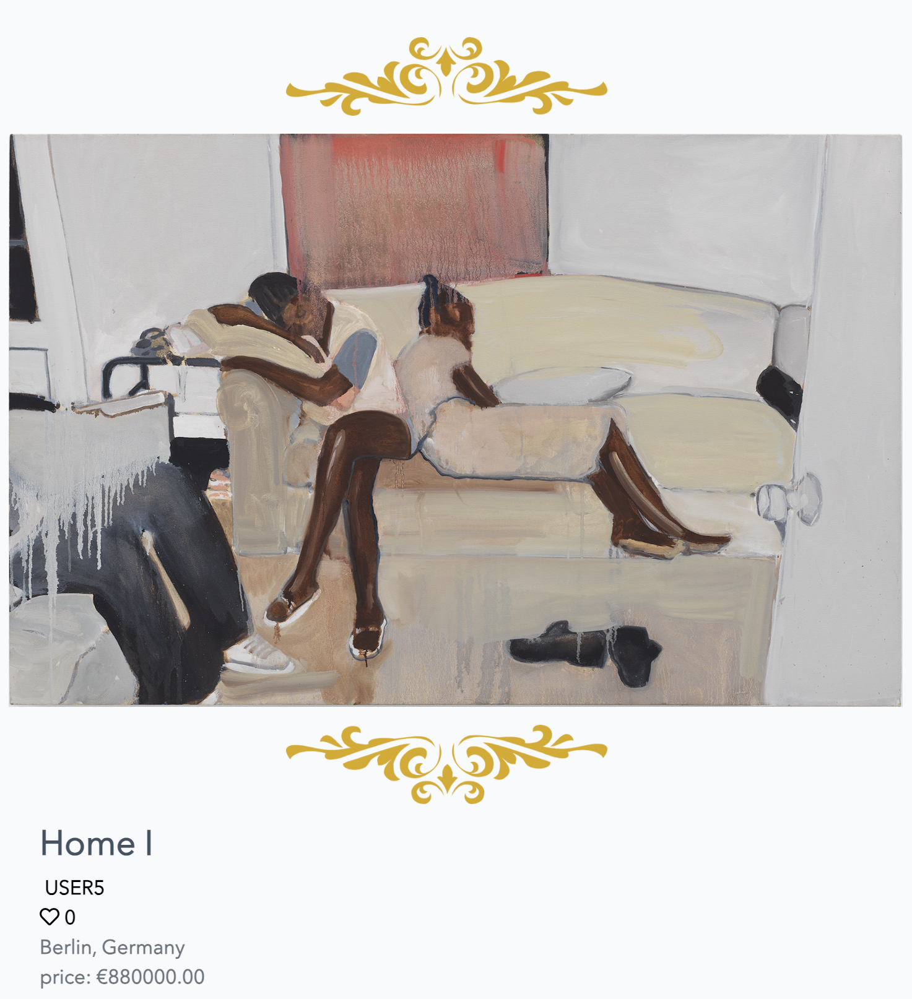
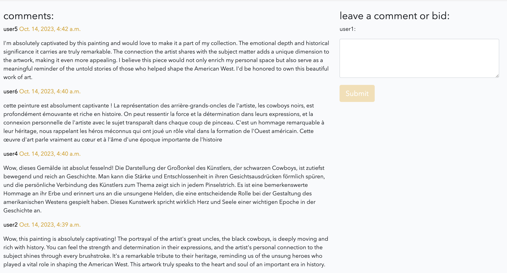

# Kunstgalerie Wien

# The Idea

This project is based on a fictious art gallery in Vienna. It allows artists to sign up then post and sell their artwork.
Users sign up create a profile and post their work. I noticed on most gallery websites the gallery doesnt really offer more information on the artists/users previous works or backgrounds .They kind of act like a buffer between artists and art buyer, maybe that is done on prupose, but I wanted to update that model and bring it slighlty into 2023.

Required technologies:

- HTML, CSS, JavaScript, Python+Django
- Relational database

The live version url: https://SLATT/

# Table of Contents

- [UX](#ux "UX")
  - [User Demographic](#user-demographic "User Demographic")
  - [User Goals](#user-goals "User goals")
  - [User Stories](#user-stories "User Stories")
    - [USER](#user "user")
  - [Project Idea](#project-idea "Project Idea")
  - [Site Navigation](#site-navigation "Site Navigation")
  - [Design Inception](#design-inception "Design Inception")
  - [Features](#features "Features")
  - [Existing Features](#existing-features "Existing Features")
    - [Sign In](#sign-in "Sign In")
    - [Home](#Home "Home")
    - [About](#about "About")
    - [Artists](#List-Of-Artists "List Of Artists")
    - [Register](#register "Register")
    - [Login](#login "Login")
    - [Logout](#logout "Logout")
    - [Profile](#profile-page "Profile Page")
    - [Default](#default-images "Default Images")
    - [Create Post](#create-post "Create post")
    - [Edit Post/ Delete Post](#edit-post "Edit Post")
    - [Edit Profile / Delete Profile](#edit-profile "Edit Profile")
    - [Comment](#comment "Comment")
    - [Delete Comment](#delete-comment "delete-comment")
  - [Features I would like to implement in the future](#Features-I-would-like-to-implement-in-the-future "Features I would have liked to implement")
- [Languages used](#languages-used "Languages used")
  - [Frameworks and libraries and tools](#frameworks-and-libraries-and-tools "Frameworks and libraries and tools")
  - [Installed packages](#installed-packages "Installed packages")
- [Testing](#testing "Testing")
  - [Bugs during development](#bugs-during-development "Bugs during development")
  - [Validator Testing](#validator-testing "Validator Testing")
  - [Unfixed Bugs](#unfixed-bugs "Unfixed Bugs")
- [Deployment](#deployment "deployment")
- [Content](#content "Content")
- [Credits](#credits "Credits")

## UX

### User Demographic

This application is ment for:

- Artists and Art enthusiastis

### User Goals

The users gets to display thier artwork simply and easily among other like minded contemporary artists and potential buyers in and outside of Vienna.

### User Stories

The following user stories has been implemented in the project. The user storires are based centred around users want to sign up and post, comment and be apart of the gallery.

#### USER

As a **USER** I can **create a profile** so that **I can log in**

As a **USER** I can **upload a profile picture** so that **personalize it**

As a **USER** I can **change or delete my profile picture**

As a **USER** I can **write a short bio** so that **so that other users can know about me**

As a **USER** I can **upoload artwork** so that **my art can be viewed**

As a **USER** I can **can comment on other users posts** so that **so that i can express myself**

As a **USER** I can **delete my comment** so that **if i dont like it later i can remove it**

As a **USER** I can **like other users posts** so that **I encourage others**

As a **USER** I can **edit posts** so that **update them and change them if I feel like it**

### Project Goal

Demonstrate CRUD functionailty, database manipulation and an understanding of Django frameworks + HTLM , CSS, JavaScript and Python.

### Design Inception

Initially the project was going to be a runner-instragram like app. So I started the main design ideas with that in mind. But to do what I wanted would require more knowledge than I currently possess and the design was simply ugly. So in the end I opted for something eqaully close to my hear , art , more specifially painting and Vienna.

The idea which at the heart was supposed to be instagram in spirit is actually quite simple and based on modern art gallery sites found in New York city.
The crud fucntionality came pretty simply after I had settled on an idea.

When I ditched the "Runner app " idea and settled on the art gallery idea everything clicked and I could see the design in my head exactly behinds the scenes.

### Site navigation

Two version to view to the navigation.

## Features

Kunstgalerie Wien main features:

Login/Register
Create post
Comment, Update, Delete

### Existing Features

#### Sign In

### Home

### About

### Artists

### Profile

### Register

## create profile

### Login

### Logout

### Default images

- Of course if the user chooses not to upload a profile image or does not have the image of the artwork they wish to sell default images are provided.
  
  

### Create Post

-Users can inuitively create posts.

### Post details

### Edit post / Delete post

## Edit & delete

When the user is logged in they can update and delete their posts.

### Edit profile

## Edit & Delete Profile

When the user is logged in they can update and delete their profile.

### Edit & Comment Profile

Users can comment on other users posts.

## Features I would like to implement in the future

- Buy and mail artwork functionality, more e-commerce overall
- Artists recent exhibitons, a way to update.
- A bidding system
- Artist commission portal
- More Javascript to the site

[Back to top](#ms-dashboard)

## Languages used

- HTML5
- CSS3
- Javascript
- Python
- Django

### Frameworks and libraries and tools

- GitPod
- GitHub
- Django
- Bootstrap
- Jquery

### Installed packages

- asgiref==3.5.2
- cloudinary==1.29.0
- dj-database-url==0.5.0
- dj3-cloudinary-storage==0.0.6
- Django==3.2.13
- django-allauth==0.51.0
- django-crispy-forms==1.14.0
- gunicorn==20.1.0
- oauthlib==3.2.0
- psycopg2==2.9.3
- PyJWT==2.4.0
- python3-openid==3.2.0
- pytz==2022.1
- requests-oauthlib==1.3.1
- sqlparse==0.4.2

## Testing

All testing has been done manually.
Testing as much as possible is reflected in the user stories.
Testing has been done constantly throughout all the manifestations of this project.

This is more or less how testing was done:

- Does the code do what I want it to do?
- Are there any bugs ?
- Remove bugs
- Test for CRUD functionality
- Make code "pretty"
- Run through validator

### Bugs during development

- There were not so many bugs but the bugs I did have were mostly sytanctial.

- The biggest bug happend to be syntactical. I had used the inccorect boostrap wording and it made viewing another users profile diffiuclt when already logged in. The already logged in user would upon viewing another users profile be logged in as that user but none of the actual functions came along with it.

### Unfixed Bugs

- I could not figure out how to rewrite this in way that passes.
  

  - In an earlier manifestation of the app I tried to include and infinite scroll but I got some strange "glitch" effect where there was anything more to load.

[Back to top](#ms-dashboard)

### Validator Testing

Testing with https://validator.w3.org/ shows no errors on html:

Testing with lighthouse gives the following results:

Testing and validating using pep8 validations tools:

Testing with https://jigsaw.w3.org/css-validator/ shown no errors on CSS:

## Deployment

The site was deployed to Heroku. The steps to deploy are as follows:

## Content

All creative work on this project belongs to the author of this project.

## Credits

The idea for the site layout came from art gelleries in Berlin and New York:

- [Art Galllery New York](https://www.davidzwirner.com/)
- [Art Galllery Berlin ](https://www.kindl-berlin.de/)

The artwork used to populate the site came from the following webistes:

- [Site 1](https://www.thecollector.com/5-rising-black-artists-shaking-the-art-market/)
- [Site 2](https://www.darkyellowdot.com/black-contemporary-artists/)
- [Site 3](https://www.artandobject.com/slideshows/10-contemporary-black-artists-you-should-know-more-about)
- [Site 4](https://www.thecollector.com/5-rising-black-artists-shaking-the-art-market/)
- [ Francis Bacon ](https://www.francis-bacon.com/artworks/paintings/1950s)

The random comments and back stories are a mix of [Wikipedia](https://www.wikipedia.org/) and [ChatGPT](https://chat.openai.com)

The skeleton of the project come from Code Institue project 4 [CI](https://codeinstitute.net/)

The outline for the README doc came from:

- [Readme Doc ](https://github.com/Pelikantapeten/p4-ms-dashboard)

### Acknowledgment

- My Advisor: [Lauren-Nicole Popich](https://www.linkedin.com/in/lauren-nicole-popich-1ab87539/)
