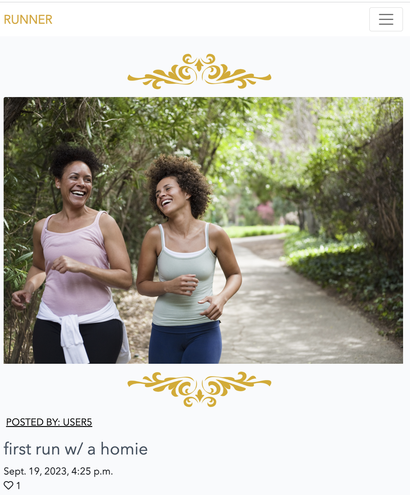
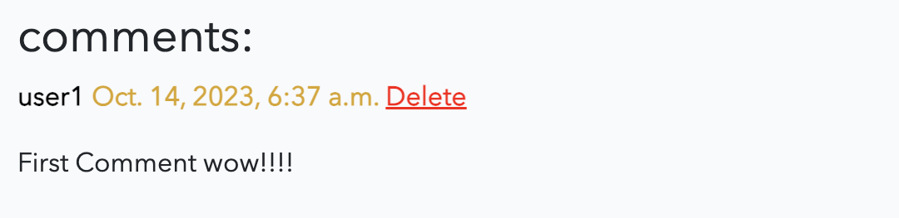

# MDash

# The main idea

This project is based on a fictious art gallery in Vienna. It allows artists to sign up then post and sell their artwork.
Users sign up create a profile and post their work. I noticed on most gallery websites the gallery doesnt really offer more information on the artists/users previous works or backgrounds .They kind of act like a buffer between artists and art buyer, maybe that is done on prupose, but I wanted to update that model and bring it slighlty into 2023.

Required technologies:

- HTML, CSS, JavaScript, Python+Django
- Relational database

The live version url: https://SLATT/

# Table of Content

- [UX](#ux "UX")
  - [User Demographic](#user-demographic "User Demographic")
  - [User Goals](#user-goals "User goals")
  - [User Stories](#user-stories "User Stories")
    - [USER](#user "user")
  - [Project Idea](#project-idea "Project Idea")
  - [Site Navigation](#site-navigation "Site Navigation")
  - [Design Inception](#design-inception "Design Inception")
  - [Features](#features "Features")
  - [Existing Features](#existing-features "Existing Features")
    - [Sign In](#sign-in "Sign In")
    - [Home](#Home "Home")
    - [About](#about "About")
    - [Artists](#List-Of-Artists "List Of Artists")
    - [Register](#register "Register")
    - [Login](#login "Login")
    - [Logout](#logout "Logout")
    - [Profile](#profile-page "Profile Page")
    - [Create Post](#create-post "Create-Post")
    - [Edit Post](#edit-post "Edit Post")
    - [Edit Profile](#edit-profile "Edit Profile")
    - [Comment](#comment "Comment")
    - [Delete Comment](#delete-comment "delete-comment")
  - [Features I would like to implement in the future](#Features-I-would-like-to-implement-in-the-future "Features I would have liked to implement")
- [Languages used](#languages-used "Languages used")
  - [Frameworks and libraries and tools](#frameworks-and-libraries-and-tools "Frameworks and libraries and tools")
  - [Installed packages](#installed-packages "Installed packages")
- [Testing](#testing "Testing")
  - [Bugs during development](#bugs-during-development "Bugs during development")
  - [Validator Testing](#validator-testing "Validator Testing")
  - [Unfixed Bugs](#unfixed-bugs "Unfixed Bugs")
- [Deployment](#deployment "deployment")
- [Content](#content "Content")
- [Credits](#credits "Credits")

## UX

### User Demographic

This application is ment for:

- Artists and Art enthusiastis

### User Goals

The users gets to display thier artwork simply and easily among other like minded contemporary artists and potential buyers in and outside of Vienna.

### User Stories

The following user stories has been implemented in the project. The user storires are based centred around users want to sign up and post, comment and be apart of the gallery.

#### Admin

As a **admin** I can **create a mentor profile** so that **the mentor can use the dashboard as a tool**

As a **course manager/admin** I can **view a list of mentors** so that **I can select one and connect the mentor to a student**

As a **course manager/admin** I can **view a list of mentors** so that **I can select one to read details, edit or delete the mentor if needed.**

As a **course manager/admin** I can **create a student profile** so that **I can add the student to a mentor**

As a **course manager/admin** I can **view a list of students** so that **I can select one to read details, edit or delete the student if needed.**

As a **course manager/admin** I can **select a student** so that **I can change the students selected mentor**

#### USER

As a **USER** I can **view a list of students** so that **I can see the ones assigned to me**

As a **mentor** I can **select a student from the list of students** so that **I can see the students profile**

As a **mentor** I can **read a student profile** so that **I can see the students name, email and course start date and end date**

As a **mentor** I can **see a list of sessions in the student profile** so that **I can see the ones that have been conducted**

As a **mentor** I can **create a session for a student** so that **I can write and save the date for the session, the duration of the session and add notes about the session**

As a **mentor** I can **select session notes** so that **I can share them with the course manager**

As a **mentor** I can **select a session** so that **I can edit the session details and delete it if necessary**

As a **Mentor** I can **search for my students** so that **I can get quick and easy access to their profiles**

As a **Mentor** I can **log the time I spent on a session** so that **I can get total time spent on students**

As a **Mentor** I can **visit my profile page** so that **I can see the total time I spent on sessions**

### Project Goal

Demonstrate CRUD functionailty, database manipulation and an understanding of Django frameworks + HTLM , CSS, JavaScript and Python.

### Design Inception

Initially the project was going to be a runner-instragram like app. So I started the main design ideas with that in mind. But to do what I wanted would require more knowledge than I currently possess and the design was simply ugly. So in the end I opted for something eqaully close to my hear , art , more specifially painting and Vienna.

The idea which at the heart was supposed to be instagram in spirit is actually quite simple and based on modern art gallery sites found in New York city.
The crud fucntionality came pretty simply after I had settled on an idea.

When I ditched the "Runner app " idea and settled on the art gallery idea everything clicked and I could see the design in my head exactly behinds the scenes.

### Site navigation

Two version to view to the navigation.

## Features

Kunstgalerie Wien main features:

Login/Register
Create post
Comment, Update, Delete

### Existing Features

#### Sign In

### Home

### About

### Artists

### Profile

### Register

## create profile

### Login

### Logout

### Create Post

### Post details

### Edit post

## Edit & delete

When the user is logged in they can update and delete their posts.

### Edit profile

## Edit & Delete Profile

When the user is logged in they can update and delete their profile.

### Comment

Users can comment on other users posts.

### Delete comment

## Features I would like to implement in the future

- Buy and mail artwork functionality
- Artists recent exhibitons
- A bidding system
- Artist commission portal
- More Javascript to the site

[Back to top](#ms-dashboard)

## Languages used

- HTML5
- CSS3
- Javascript
- Python
- Django
- SQL - Postgres

### Frameworks and libraries and tools

- GitPod
- GitHub
- Django
- Bootstrap
- DrawSQL
- Jquery

### Installed packages

- asgiref==3.5.2
- cloudinary==1.29.0
- dj-database-url==0.5.0
- dj3-cloudinary-storage==0.0.6
- Django==3.2.13
- django-allauth==0.51.0
- django-crispy-forms==1.14.0
- gunicorn==20.1.0
- oauthlib==3.2.0
- psycopg2==2.9.3
- PyJWT==2.4.0
- python3-openid==3.2.0
- pytz==2022.1
- requests-oauthlib==1.3.1
- sqlparse==0.4.2

## Testing

All testing has been done manually.
Testing as much as possible is reflected in the user stories.
Testing has been done constantly throughout all the manifestations of this project.

This is more or less how testing was done:

- Does the code do what I want it to do?
- Are there any bugs ?
- Remove bugs
- Test for CRUD functionality
- Make code "pretty"
- Run through validator

There were not so many bugs but the bugs I did have were mostly sytanctial.

### Bugs during development

- The biggest bug happend to be syntactical. I had used the inccorect boostrap wording and it made viewing another users profile diffiuclt when already logged in. The already logged in user would upon viewing another users profile be logged in as that user but none of the actual functions came along with it. 

## THE UPDATE EDIT USER THIING

There have been several small bugs during development. Most of them has been resolved by fixing faulty syntax but also a lot of them has been caused by logical errors. More sever bugs have been:

- All users had admin rights
  - Solution: Creating function that closes admin for non-staff users (Mentors)
- Problems in getting a proper datestamp using date-selector in create session
  - Solution: Creating a date-picker in widget.py and use widget in forms
- Problem: Not allowing users to log in with only e-mail
  - Solution: Scrapping auth user model and creating new custom user models based on BaseUserManager.
- Problem: Custom CSS not "active" on heroku
  - Solution: Set Collect Static to 0 and not use debug mode in settings.py

Andy many more smaller ones that caused different types of errors but mostly were connected to bad syntax.

### Validator Testing

Testing with https://validator.w3.org/ shows no errors on html:

Testing with lighthouse gives the following results:

Testing and validating using pep8 validations tools:

All python code in this project is not perfect. Some are showing errors of lines that are to long, especially in settings.py and in other files that are installed as part of django. The majority of the problems are not causing errors and are not from code that I actually wrote. Therefore it's not possible to produce a clean slate of a perfect record since some of the code is not perfect but still functional.

Testing with https://jigsaw.w3.org/css-validator/ shown no errors on CSS:

### Unfixed Bugs

- I could not figure out how to rewrite this in way that passes.
  

[Back to top](#ms-dashboard)

## Deployment

The site was deployed to Heroku. The steps to deploy are as follows:

The project was developed using Gitpod with regular commits to Github. In order to deploy to Heroku a requirements.txt file needs to be created
and it is important that the database is created in Heroku so that the database can be migrated before actual deployment.

Before migrating the database I used the following cofigvars:

- key: SECRET_KEY | value
- key: PORT | value
- key: DATABASE_URL | value

All values was provided by Heroku and I used env.py to store the values for my project and used the variables for the values in settings.py for the Database url and secret key. Heroku also needs to be set as an allowed host in settings.py (please see settings.py in this repository for details).

Migration of database can be done prior of deployment. If set up correctly your environment will use Herokus database and not local sqlite.

Before the push to GitHub a procfile needs to be created with the content: web: gunicorn msdashboard2022.wsgi

After deployment push to Github the project was deployed from Heroku using the "Deploy" tab.

After those steps were taken the application was deployed at the following link: https://ms-dashboard2022.herokuapp.com/

## Content

All creative work on this project belongs to the author of this project. 

## Credits

### For code inspiration, design inputs, help and advice.

I have consulted numerous websites, individuals and slack channels to get support for the code. No code block is directly copied (a part from the ones stated in the comments in the code) but some generates from information I gathered from other developers and sites:

- [W3 Schools](https://www.w3schools.com) for helping me understand Django.
- [Code Institute](https://codeinstitute.net/) for all course material leading up to this project.
- [Stack Overflow](https://stackoverflow.com/) for hours of searching and troubleshooting.

And all the "hundreds of sites" I partially visited during my trouble shooting. All code that I have borrowed have been commented in the code.

### Acknowledgment

- [Lauren-Nicole Popich](https://www.linkedin.com/in/lauren-nicole-popich-1ab87539/) Thank you for testing dealing with my stress over this project, you are a life saver!

[Am I Responsive](http://ami.responsivedesign.is/) was used to create the image on top of this ReadMe
